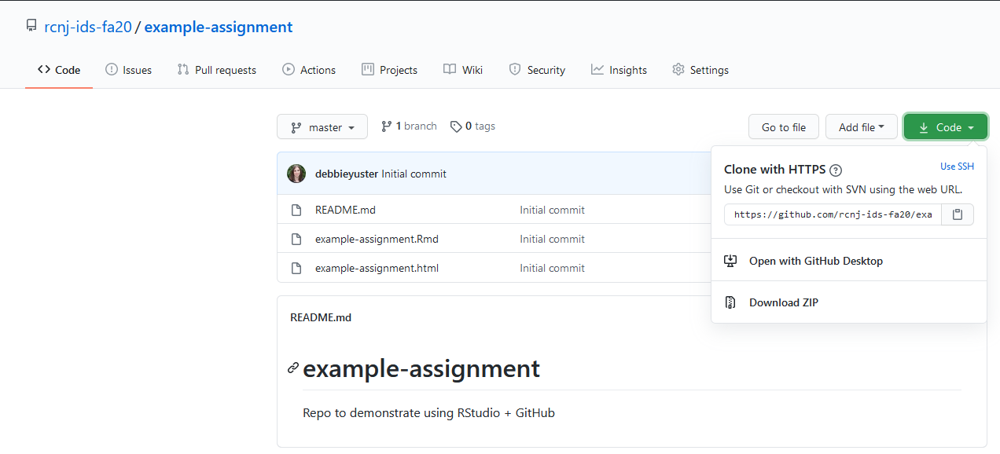
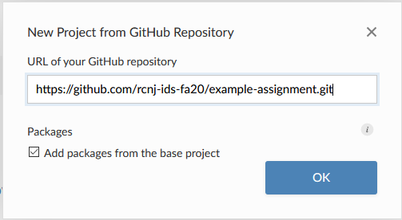
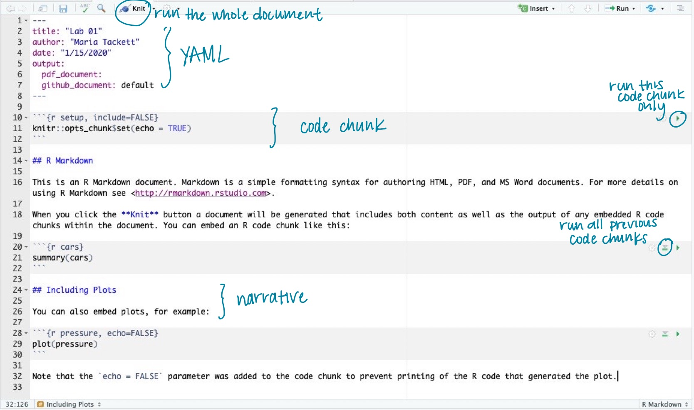
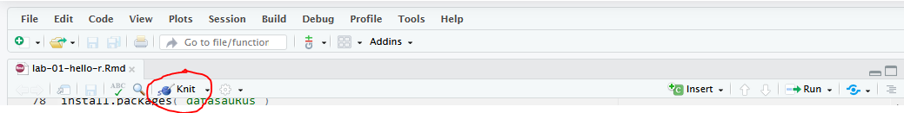
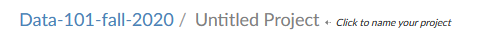

```{marginfigure}
R is the name of the programming language itself and RStudio is a convenient interface.
```

The main goal of this lab is to introduce you to R and RStudio, which we will be using throughout the course both to learn the statistical concepts discussed in the course and to analyze real data and come to informed conclusions. 

```{marginfigure}
git is a version control system (like "Track Changes" features from Microsoft Word on steroids) and GitHub is the home for your Git-based projects on the internet (like DropBox but much, much better).
```

An additional goal is to introduce you to git and GitHub, which is the collaboration and version control system that we will be using throughout the course.

As the labs progress, you are encouraged to explore beyond what the labs dictate; a willingness to experiment will make you a much better programmer. Before we get to that stage, however, you need to build some basic fluency in R. Today we begin with the fundamental building blocks of R and RStudio: the interface, reading in data, and basic commands.

And to make versioning simpler, this is a solo lab. Additionally, we want to make sure everyone gets a significant amount of time at the steering wheel. In the future you'll learn about collaborating on GitHub and produce a single lab report for your team.

**Your instructor will lead you through the Getting started and Warm up sections.** 

# Getting started

Each of your assignments will begin with the following steps. You saw these once in this week's lessons, and they're outlined in detail here again. Going forward each lab will start with a "Getting started" section but details will be a bit more sparse than this. You can always refer back to this lab for a detailed list of the steps involved for getting started with an assignment.

## Clone the repo & start new RStudio project

- Go to the rcnj-ids-fa20 organization on GitHub (https://github.com/rcnj-ids-fa20). Click on the repo with the prefix **lab-01-hello-r-**. It contains the starter documents you need to complete the lab.

- Click on the green **Code** button, select **Use HTTPS** (this might already be selected by default, and if it is, you'll see the text **Clone with HTTPS** as in the image below). Click on the clipboard icon to copy the repo URL.

```{r clone-repo-link, echo = FALSE, fig.width = 5}

```

- Go to RStudio Cloud and into the course workspace. Create a **New Project from Git Repo**. You will need to click on the down arrow next to the **New Project** button to see this option.

```{r paste-gh-repo-url, echo = FALSE,  out.width = "80%"}

```

- Copy and paste the URL of your assignment repo into the dialog box. Leave the option "Add packages from the base project" checked.

- Hit OK, and you're good to go!

## RStudio & R Markdown

As a reminder, here are two images to get you (re)oriented with RStudio and R Markdown layouts:
Below are the general components of an RStudio project. 

```{r echo=FALSE, fig.fullwidth = TRUE, out.width = "90%"}
knitr::include_graphics("img/rstudio-panes.png")
```

Below are the general components of an RMarkdown file. 

```{r echo=FALSE, fig.fullwidth = TRUE, out.width = "90%"}

```

To get more details about the RStudio project, RMarkdown file, and just R in general, read [Getting Started](https://socviz.co/gettingstarted.html#gettingstarted) in *Data Visualization* by Kieran Healy.

## Packages

In this lab we will work with two packages: `datasauRus` which contains the dataset, and `tidyverse` which is a collection of packages for doing data analysis in a "tidy" way.

Note, if you need to install the packages, you can install the `tidyverse` and `datasauRus` packages in the **console** (watch out for capitalization), but if you loaded the base project when creating this RStudio Cloud project, some packages should already be installed, and only need to be loaded (remember that the console and the R Markdown environments are separate!). (There is no harm in installing a package that is already installed.)

Install these packages by running the following in the **Console** window of RStudio.

```{r eval = FALSE}
install.packages("tidyverse")
install.packages("datasauRus")
```

Now that the necessary packages are installed, you should be able to Knit your document and see the results.
Open the R Markdown (Rmd) file in your project by clicking its name in the lower right pane Files tab. Knit your document by clicking Knit at the top of the Source Editor pane.

```{r echo=FALSE, fig.fullwidth = TRUE, out.width = "90%"}

```

If you'd like to run your code in the Console as well (as an optional addition to knitting your R Markdown document) you'll also need to load the packages there. To do so, run the following in the console. 

```{r message=FALSE}
library(tidyverse) 
library(datasauRus)
```

Note that the packages are also loaded using these same commands in your R Markdown document.

To summarize the two steps in enabling packages:

**1.**   A package gets **installed** once per project by either:

+ inheriting the package installation from the base project, or

+ using the `install.packages()` command in the console, and then

**2.**   The package gets **loaded** once per R session using the `library()` command, either within the R Markdown document or from the console.

## Configure git 

There is one more piece of housekeeping we need to take care of before we get started. Specifically,  we need to configure your git so that RStudio can communicate with GitHub. This requires two pieces of information: your name and email address.

To do so, you will use the `use_git_config` function from the `usethis` package. 

Type the following lines of code in the **console** in RStudio, filling in your name and email address.

```{marginfigure}
The email address is the one tied to your GitHub account. 
```

```{r eval=FALSE}
library(usethis)
use_git_config(user.name = "your name", user.email = "your email")
```

For example, mine would be 

```{r eval=FALSE}
library(usethis)
use_git_config(user.name = "Debbie Yuster", user.email = "dyuster@ramapo.edu")
```

If you get the error message

```{r eval=FALSE}
Error in library(usethis) : there is no package called ‘usethis’
```

then you need to install the `usethis` package. Run the following code in the console to install the package. Then, rerun the `use_git_config` function with your name and the email address associated with your GitHub account.

```{r eval=FALSE}
install.package("usethis")
```

Once you run the configuration code, your values for `user.name` and `user.email` will display in the console. If your `user.name` and `user.email` are correct, you're good to go! Otherwise, run the code again with the necessary changes.

# Warm up

Before we introduce the data, let's warm up with some simple exercises. The following video is an overview of some of these warm-up exercises - **you do not need to watch it now**, but can refer to it if you get stuck below.

<div style="position:relative;height:0;padding-bottom:30%"><iframe width="600" height="320" src="https://www.youtube.com/embed/XE8h8jIyu04" frameborder="0" allow="autoplay; encrypted-media" allowfullscreen></iframe></div>

## Project name

Currently your project is called *Untitled Project*. Update the name of your project to be "Lab 01 - Hello R".

```{r untitled-project, fig.fullwidth=TRUE, echo = FALSE}

```

## YAML

The top portion of your R Markdown file (between the three dashed lines) is called YAML. It stands for "YAML Ain't Markup Language". It is a human friendly data serialization standard for all programming languages. All you need to know is that this area is called the YAML (we will refer to it as such) and that it contains meta information about your document.
In your R Markdown (Rmd) file, change the author name to your name, and knit the document.

```{r yaml-raw-to-rendered, fig.fullwidth=TRUE, echo = FALSE}
knitr::include_graphics("img/yaml-raw-to-rendered.png")
```

## Committing changes

Now, go to the Git pane in your RStudio instance. This will be in the top right hand corner in a separate tab.

If you have made changes to your Rmd file, you should see it listed here. Click on it to select it in this list and then click on **Diff**. This shows you the <u>diff</u>erence between the last committed state of the document and its current state that includes your changes. You should see deletions in red and additions in green. As well, you can see exactly which lines were changed. If you've knitted your R Markdown document, the html output will have changed too.

If you're happy with these changes, we'll prepare the changes to be pushed to your remote repository. First, **stage** your changes by checking the appropriate box on the files you want to prepare (in this case, the .Rmd file and the .html file). Next, write a meaningful commit message (for instance, "Updated author name") in the **Commit message** box. Finally, click **Commit**. Note that every commit needs to have a commit message associated with it.

```{r update-author-name-commit, fig.fullwidth=TRUE, echo = FALSE}
knitr::include_graphics("img/update-author-name-commit.png")
```

You don't have to commit after every change, this would get quite cumbersome. You should consider committing states that are *meaningful to you* for inspection, comparison, or restoration. In the first few assignments we will tell you exactly when to commit and in some cases, what commit message to use. As the semester progresses we will let you make these decisions.

## Pushing changes

Now that you have made an update and committed this change, it's time to push these changes to the web! Or more specifically, to your repo on GitHub. Why? So that others can see your changes. And by others, we mean the course instructor (your repos in this course are private to you and me, only). In later weeks, you will be doing labs in groups and will want your groupmates to see your changes as well.

In order to push your changes to GitHub, you must have **staged** your **commit** to be pushed. Then click on **Push**. This will prompt a dialogue box where you first need to enter your GitHub username, and then your GitHub password. Don't worry, we will soon teach you how to save your password so you don't have to enter it every time. But for now you'll have to manually enter your username and password each time you push, in order to gain some experience with the process.

# The data

```{marginfigure}
If it's confusing that the data frame is called `datasaurus_dozen` when it contains 13 datasets, you're not alone! Have you heard of a [baker's dozen](https://en.wikipedia.org/wiki/Dozen#Baker's_dozen)?
```

The data frame we will be working with today is called `datasaurus_dozen` and it's in the `datasauRus` package. Actually, this single data frame contains 13 datasets, designed to show us  why data visualization is important and how summary statistics alone can be misleading. The different datasets are marked by the `dataset` variable.

To find out more about the dataset, type the following in your **console**.

```{r eval=FALSE}
?datasaurus_dozen
```

A question mark before the name of an object will always bring up its help file. Alternatively, you can use 

```{r eval=FALSE}
help(datasaurus_dozen)
```

These commands must be run in the **console**.

## Exercises

1. Based on the help file, how many rows and how many columns does the `datasaurus_dozen` file have? What are the variables included in the data frame? Add your responses to your lab report. When you're done, commit your changes with the commit message "Added answer for Ex 1", and push.

Let's take a look at what these datasets are. To do so we can make a *frequency table* of the dataset variable:

```{r}
datasaurus_dozen %>%
  count(dataset) %>%
  print(13)
```

```{marginfigure}
Matejka, Justin, and George Fitzmaurice. "Same stats, different graphs: Generating datasets with varied appearance and identical statistics through simulated annealing." Proceedings of the 2017 CHI Conference on Human Factors in Computing Systems. ACM, 2017.
```

The original Datasaurus (`dino`) was created by Alberto Cairo in [this great blog post](http://www.thefunctionalart.com/2016/08/download-datasaurus-never-trust-summary.html). The other Dozen were generated using simulated annealing and the process is described in the paper *Same Stats, Different Graphs: Generating Datasets with Varied Appearance and Identical Statistics* through Simulated Annealing by Justin Matejka and George Fitzmaurice. In the paper, the authors simulate a variety of datasets that have the same summary statistics as the Datasaurus, but have very different distributions.

2. Plot `y` vs. `x` for the `dino` dataset. Then, calculate the correlation coefficient between `x` and `y` for this dataset.

Below is the code you will need to complete this exercise. Basically, the answer is already given, but you need to include relevant bits in your Rmd document and successfully knit it and view the results.

Start with the `datasaurus_dozen` and pipe it into the `filter` function to filter for observations where `dataset == "dino"`. Store the resulting filtered data frame as a new data frame called `dino_data`.

```{r}
dino_data <- datasaurus_dozen %>%
  filter(dataset == "dino")
```

There is a lot going on here, so let's slow down and unpack it a bit. 

First, the pipe operator: `%>%`, takes what comes before it and sends it as the first argument to what comes after it. So here, we're saying `filter` the `datasaurus_dozen` data frame for observations where `dataset == "dino"`.

Second, the assignment operator: `<-`, assigns the name `dino_data` to the filtered data frame.

Next, we need to visualize these data. We will use the `ggplot` function for this. Its first argument is the data you're visualizing. Next we define the `aes`thetic mappings. In other words, the columns of the data that get mapped to certain aesthetic features of the plot, e.g. the `x` axis will represent the variable called `x` and the `y` axis will represent the variable called `y`. Then, we add another layer to this plot where we define which `geom`etric shapes we want to use to represent each observation in the data. In this case we want these to be points, hence `geom_point`.

```{r fig.fullwidth=TRUE}
ggplot(data = dino_data, mapping = aes(x = x, y = y)) +
  geom_point()
```

If this seems like a lot, it is. You will learn about the philosophy of building data visualizations with layers in detail next week. For now, just follow along with the code that is provided.

For the second part of these exercises, we need to calculate a summary statistic: the correlation coefficient. Correlation coefficient, often referred to as $r$ in statistics, measures the linear association between two variables. You will see that some of the pairs of variables we plot do not have a linear relationship between them. A linear relationship looks like the points in the plot roughly follow the shape of a line. This is exactly why we want to visualize first: visualize to assess the form of the relationship, and calculate $r$ only if relevant. In this case, calculating a correlation coefficient really doesn't make sense since the relationship between `x` and `y` is definitely not linear -- it's dinosaurial!

But, for illustrative purposes, let's calculate the correlation coefficient between `x` and `y`.

```{marginfigure}
Start with `dino_data` and calculate a summary statistic that we will call `r` as the `cor`relation between `x` and `y`.
```

```{r}
dino_data %>%
  summarize(r = cor(x, y))
```

*This is a good place to pause, commit changes with the commit message "Added answer for Ex 2", and push.*

3. Plot `y` vs. `x` for the `star` dataset. You can (and should) reuse code we introduced above. Don't overwrite it; rather, copy and paste it. Replace the dataset name with the desired dataset. Then, calculate the correlation coefficient between `x` and `y` for this dataset. How does this value compare to the `r` of `dino`?

*This is another good place to pause, commit changes with the commit message "Added answer for Ex 3", and push.*

4. Plot `y` vs. `x` for the `circle` dataset. You can (and should) reuse code we introduced above, just replace the dataset name with the desired dataset. Then, calculate the correlation coefficient between `x` and `y` for this dataset. How does this value compare to the `r` of `dino`?

*You should pause again, commit changes with the commit message "Added answer for Ex 4", and push.*


5. Finally, let's plot all the datasets at once. In order to do this we will make use of facetting.

```{marginfigure}
Facet by the dataset variable, placing the plots in a 3 column grid, and don't add a legend.
```


```{r all-viz, eval=FALSE, fig.fullwidth=TRUE}
ggplot(datasaurus_dozen, aes(x = x, y = y, color = dataset))+
  geom_point()+
  facet_wrap(~ dataset, ncol = 3) +
  theme(legend.position = "none")
```

And we can use the `group_by` function to generate all the summary correlation coefficients.

```{r all-r, eval=FALSE}
datasaurus_dozen %>%
  group_by(dataset) %>%
  summarize(r = cor(x, y)) %>%
  print(13)
```

You're done with the data analysis exercises, but we'd like to customize the look of the report.

```{r fig-resize-global, fig.margin = TRUE, echo = FALSE, fig.width=3}
knitr::include_graphics("img/fig-resize-global.png")
```


## Resize your figures

We can customize the output from a particular R chunk by including options in the header that will override any global settings. 

6. In the R chunks you wrote for Exercises 2 - 5, customize the settings by modifying the **options** in the R chunks used to create those figures. 

For Exercises 2, 3, and 4, we want square figures. We can use `fig.height` and `fig.width` in the options to adjust the height and width of figures. Modify the chunks in Exercises 2 - 4 to be as follows:

` ```{r ex2-chunk-name, fig.height=5, fig.width=5} `
```{r, eval = FALSE}
Your code that created the figure
```
` ``` `

For Exercise 5, modify your figure to have `fig.height` of 10 and `fig.width` of 6.

Now, save and knit.

## Wrap Up and Submission

<div class = "commit"> Commit all remaining changes, use the commit message "Done with Lab 1!" and push. 
</div> 

When you are finished, you must submit a PDF of your lab writeup to Gradescope. Once you are fully satisfied with your lab, **Knit to .pdf** to create a PDF document. You may notice that the formatting/theme of the report has changed -- this is expected.

**Before you wrap up the assignment, make sure all documents are updated on your GitHub repo. I will be checking these to make sure you have been practicing how to commit and push changes.**

**Remember -- you must submit a PDF file to Gradescope before the submission deadline for credit.** 

To submit your assignment: 

- Go to http://www.gradescope.com and log in (you should have created your account by now, using the invitation that was emailed to you). 

- Click on your DATA 101 course. 

- Click on the assignment, and you'll be prompted to submit it.

- Mark the pages associated with each exercise, 1 - 5. All of the papers of your lab should be associated with at least one question (i.e., should be "checked"). 

- Select the first page of your PDF submission to be associated with the *"Overall"* section.

<br>


