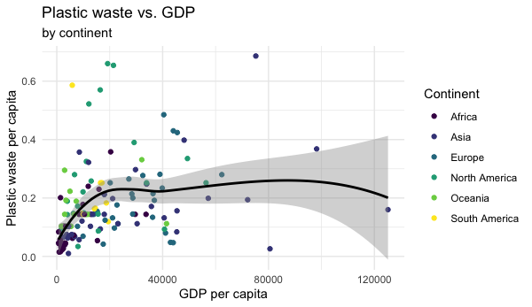

```{r setup, include=FALSE}
knitr::opts_chunk$set(eval = FALSE)
```

```{marginfigure}
**A note on expectations:** For each exercise, your answer should include any relevant output (tables, summary statistics, plots), as well as any required narrative.
```

Plastic pollution is a major and growing problem, negatively affecting oceans and wildlife health. [Our World in Data](https://ourworldindata.org/plastic-pollution) has a lot of great data at various levels including globally, per country, and over time. For this lab we focus on data from 2010.

Additionally, National Geographic recently ran a data visualization communication contest on plastic waste as seen [here](https://www.nationalgeographic.org/funding-opportunities/innovation-challenges/plastic/dataviz/).

# Learning goals

- Visualize numerical and categorical data.
- Recreate visualizations.
- Get more practice using with Git and GitHub.

## Getting started

Go to the course [GitHub organization](https://github.com/rcnj-ids-fa20) and locate your Lab 02 repo, which should be named `lab-02-plastic-waste-YOUR_GITHUB_USERNAME`. Grab the URL of the repo, and clone it in RStudio. Be sure that within RStudio, you are working in our course workspace, 'data-101-fall-2020', and not in 'Your Workspace'. Refer to [Lab 01](/labs/lab-01/lab-01-hello-r) if you would like to see step-by-step instructions for cloning a repo into an RStudio project.

Next, open the R Markdown document `lab-02-plastic-waste.Rmd` and Knit it. Make sure it compiles without errors. The output will be in the html file `.html` file with the same name.

## Configure git

```{marginfigure}
Your email address should be the one tied to your GitHub account.
```

Before we can get started we need to do one more thing.  Specifically,  we need to configure your git so that RStudio can communicate with GitHub. This requires two pieces of information: your email address and your name.

To do so, run the following in the Console:

```{r eval=FALSE}
usethis::use_git_config(user.name = "Your Name", user.email = "your_email@example.com")
```

## Update the name and date

You will write your answers in the document `lab-02-plastic-waste.Rmd`. Before starting the exercises, be sure to update the author name and date in the YAML at the top of the .Rmd file. Knit the document and make sure the resulting file has your name and date. 

## Packages

We'll use the **tidyverse** package for this analysis. Run the following code in the Console to load this package.

```{r load-packages, message=FALSE, eval=TRUE}
library(tidyverse)
```

## Data

The dataset for this assignment can be found as a csv file in the `data` folder of your repository. You can read it in using the following:

```{r load-data, message=FALSE, eval=TRUE}
plastic_waste <- read_csv("data/plastic-waste.csv")
```

The variable descriptions are as follows:

- `code`: 3 Letter country code
- `entity`: Country name
- `continent`: Continent name
- `year`: Year
- `gdp_per_cap`: GDP per capita constant 2011 international $, rate
- `plastic_waste_per_cap`: Amount of plastic waste per capita in kg/day
- `mismanaged_plastic_waste_per_cap`: Amount of mismanaged plastic waste per capita in kg/day
- `mismanaged_plastic_waste`: Tons of mismanaged plastic waste
- `coastal_pop`: Number of individuals living on/near coast
- `total_pop`: Total population according to Gapminder

# Warm up with your team

You have 5 minutes to complete this section.

- Recall that RStudio is divided into four panes. Without looking, can you name them all and briefly describe their purpose?
- Verify that the dataset has loaded into the Environment. How many observations are in the dataset? Clicking on the dataset in the Environment will allow you to inspect it more carefully. Alternatively, you can type `View(plastic_waste)` into the Console to do this. 

```{marginfigure}
Hint: If you're not sure, run the command `?NA` which will lead you to the documentation.
```

- Have a quick look at the data and notice that there are cells taking the value `NA` -- what does this mean?

<details><summary>Show answers</summary>
  <ul><small>
   <li> Editor; Console; Environment, history, git; Files, plots, packages, help, viewer
   <li>240</li>
   <li> Not Available, indicates missing values</li>
   </small>
  </ul>
</details>

# Exercises

Let's start by taking a look at the distribution of plastic waste per capita in 2010.

```{r plastic_waste_per_cap-hist, eval=TRUE}
ggplot(data = plastic_waste, aes(x = plastic_waste_per_cap)) +
  geom_histogram(binwidth = 0.2)
```

One country stands out as an unusual observation at the top of the distribution. One way of identifying this country is to filter the data for countries where plastic waste per capita is greater than 3.5 kg/person.

```{r plastic_waste_per_cap-max, eval=TRUE}
plastic_waste %>%
  filter(plastic_waste_per_cap > 3.5)
```

Did you expect this result? You might consider doing some research on Trinidad and Tobago to see why plastic waste per capita is so high there, or whether this is a data error.

1. Plot, using histograms, the distribution of plastic waste per capita faceted by continent. What can you say about how the continents compare to each other in terms of their plastic waste per capita?

Another way of visualizing numerical data is using density plots.

```{r plastic_waste_per_cap-dens, eval=TRUE}
ggplot(data = plastic_waste, aes(x = plastic_waste_per_cap)) +
  geom_density()
```

And compare distributions across continents by coloring density curves by continent.

```{r plastic_waste_per_cap-dens-color, eval=TRUE}
ggplot(data = plastic_waste, 
       mapping = aes(x = plastic_waste_per_cap, 
                     color = continent)) +
  geom_density()
```

The resulting plot may be a little difficult to read, so let's also fill the curves in with colors as well.

```{r plastic_waste_per_cap-dens-color-fill, eval=TRUE}
ggplot(data = plastic_waste, 
       mapping = aes(x = plastic_waste_per_cap, 
                     color = continent, 
                     fill = continent)) +
  geom_density()
```

The overlapping colors make it difficult to tell what's happening with the distributions in continents plotted first, and hence covered by continents plotted over them. We can change the transparency level of the fill color to help with this. The `alpha` argument takes values between 0 and 1: 0 is completely transparent and 1 is completely opaque. There is no way to tell what value will work best, so you just need to try a few.

```{r plastic_waste_per_cap-dens-color-fill-alpha, eval=TRUE}
ggplot(data = plastic_waste, 
       mapping = aes(x = plastic_waste_per_cap, 
                     color = continent, 
                     fill = continent)) +
  geom_density(alpha = 0.7)
```

This still doesn't look great...

1. Recreate the density plot above using a different (lower) alpha level that works better for displaying the density curves for all continents.

1. Describe why we defined the `color` and `fill` of the curves by mapping aesthetics of the plot but we defined the `alpha` level as a characteristic of the plotting geom.

`r emo::ji("white_check_mark")` `r emo::ji("arrow_up")` *Now is a good time to commit and push your changes to GitHub with an appropriate commit message. Make sure to commit and push all changed files so that your Git pane is cleared up afterwards.*

And yet another way to visualize this relationship is using side-by-side box plots.

```{r plastic_waste_per_cap-box, eval=TRUE}
ggplot(data = plastic_waste, 
       mapping = aes(x = continent, 
                     y = plastic_waste_per_cap)) +
  geom_boxplot()
```

1. Learn something new: violin plots! Read about them at http://ggplot2.tidyverse.org/reference/geom_violin.html, 
and convert your side-by-side box plots from the previous task to violin plots. 
What do the violin plots reveal that box plots do not? What features are 
apparent in the box plots but not in the violin plots?

```{marginfigure}
Remember that we use `geom_point()` to make scatterplots.
```

1. Visualize the relationship between plastic waste per capita and mismanaged plastic waste per capita using a scatterplot. Describe the relationship.

1. Color the points in the scatterplot by continent. Does there seem to be any clear distinctions between continents with respect to how plastic waste per capita and mismanaged plastic waste per capita are associated?

1. Visualize the relationship between plastic waste per capita and total population as well as plastic waste per capita and coastal population. Do either of these pairs of variables appear to be more strongly linearly associated?

`r emo::ji("white_check_mark")` `r emo::ji("arrow_up")` *Now is another good time to commit and push your changes to GitHub with an appropriate commit message. Make sure to commit and push all changed files so that your Git pane is cleared up afterwards.*

```{marginfigure}
Hint: The colors are from the viridis color palette. Take a look at the functions starting with `scale_color_viridis_*` in the [ggplot2 reference page](https://ggplot2.tidyverse.org/reference/scale_viridis.html)..
```

1. Recreate the following plot, and interpret what you see in the context of the data. Use the code below to filter out any countries with plastic waste per capita over 3 kg/per day. The code below names this filtered dataset as `plastic_waste_small`. Use the filtered dataset for the plot. (We'll learn more about the `filter` function in the coming weeks.)


```{r eval = F}
plastic_waste_small <- plastic_waste %>%
  filter(plastic_waste_per_cap < 3)
```


```{r echo  = FALSE, fig.align = "center", eval = TRUE, out.width = "250%"}

```


<!-- # ```{r echo=FALSE, message=FALSE, eval=TRUE, warning=FALSE} -->
<!-- # plastic_waste %>%  -->
<!-- #   mutate(coastal_pop_prop = coastal_pop / total_pop) %>% -->
<!-- #   filter(plastic_waste_per_cap < 3) %>% -->
<!-- #   ggplot(aes(x = coastal_pop_prop, y = plastic_waste_per_cap, color = continent)) +  -->
<!-- #     geom_point() + -->
<!-- #     geom_smooth(color = "black") + -->
<!-- #     scale_color_viridis_d() + -->
<!-- #     labs(x = "Coastal population proportion (Coastal / total population)",  -->
<!-- #          y = "Plastic waste per capita ",  -->
<!-- #          color = "Continent", -->
<!-- #          title = "Plastic waste vs. coastal population proportion", -->
<!-- #          subtitle = "by continent") + -->
<!-- #     theme_minimal() -->
<!-- # ``` -->

`r emo::ji("white_check_mark")` `r emo::ji("arrow_up")` *Commit and push your changes to GitHub with an appropriate commit message again. Make sure to commit and push all changed files so that your Git pane is cleared up afterwards.*

# Submission

**Before you wrap up the assignment, make sure all documents are updated on your GitHub repo. There will be points allocated to proper GitHub use.**

When you are finished, you must submit a PDF of your lab writeup to Gradescope. Once you are fully satisfied with your lab, **Knit to .pdf** to create a PDF document. You may notice that the formatting/theme of the report has changed -- this is expected. Download this PDF file, by checking it in the RStudio Files pane, clicking More, and then Export...

To submit your assignment: 

- Go to http://www.gradescope.com and log in

- Click on your DATA 101 course. 

- Click on the assignment, and you'll be prompted to submit the PDF.

- Mark the pages associated with each exercise. All of the papers of your lab should be associated with at least one question (i.e., should be "checked"). 

- Select the first page of your PDF submission to be associated with the *"GitHub use"* question.
