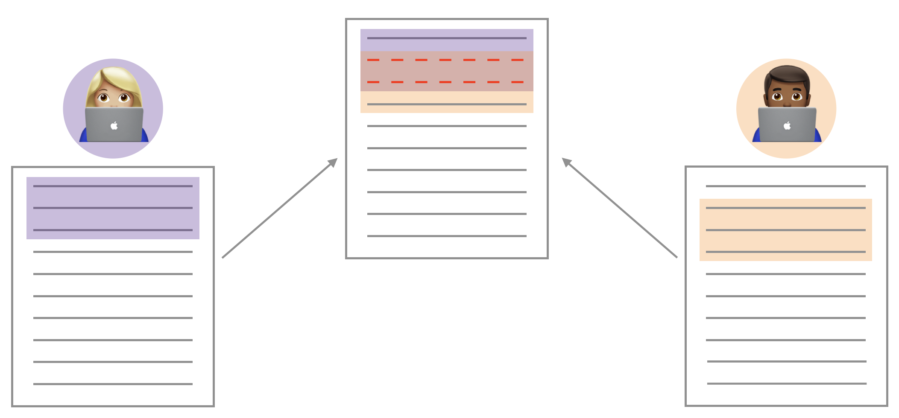

```{r include=FALSE}
library(tufte)
library(knitr)
options(
  htmltools.dir.version = FALSE, # for blogdown
  show.signif.stars = FALSE,     # for regression output
  digits = 2
  )
knitr::opts_chunk$set(eval = FALSE)
```

# Introduction 

Before we get started on today's lab, we will look at something that may happen as you collaborate with your lab team (or any other team!) in GitHub.

# Merge Conflicts (uh oh)

```{marginfigure}
(Merge conflict images from Maria Tackett.)
```

```{r fig.margin=TRUE, fig.cap = "Changes to different lines: No merge conflict", eval=TRUE, echo=FALSE}
include_graphics("./img/merge-no-conflict.png")
```

## Merge conflicts

- When two collaborators make changes to a file and push the file to their repo, git merges these two files.
- If these two files have conflicting content on the same line, git will produce a **merge conflict**.

```{r fig.margin=TRUE, fig.cap = "Changes to same lines: Merge conflict", eval = TRUE, echo=FALSE}

```


Merge conflicts need to be resolved manually. This is what you will see in the file with the merge conflict:

```{r fig.margin=FALSE, eval=TRUE, echo=FALSE}
include_graphics("img/merge-conflict-identifiers.png")
```

To resolve the merge conflict, decide if you want to keep only your text, the 
text on GitHub, or incorporate changes from both texts. Delete the conflict 
markers `<<<<<<<`, `=======`, `>>>>>>>` and make the changes you want in the 
final merge.

## Let's cause a merge conflict!

**Assign numbers 1, 2, 3, and 4 to each of your team members** (if there are only 3 team 
members, just number 1 through 3). Go through the following steps in detail, 
which simulate a merge conflict. Completing this exercise will be part of the 
lab grade.

**Everyone** clone the group's **lab-04-viz-sp-data** assignment repo (from GitHub) in RStudio (within our course workspace) and open the file **merge-conflict.Rmd**.

`r emo::ji("stop_sign")` Nobody should move on until all group members have completed this step.

**Member 4** will be in charge of looking at the group’s repo on GitHub.com to ensure that the other 
members’ files are pushed to GitHub after every step.

**Member 1:** Change the team name to your team name. Knit, commit, and push.

`r emo::ji("stop_sign")` Nobody should move on until this step is complete.

**Member 2:** Change the team name to something different (i.e., not your
team name). Knit, commit, and push. 

You should get an error.

**Pull** and review the document with the merge conflict. Read the error to your teammates. You can also show them the error by sharing your screen. A merge conflict occurred because you edited the same part of the 
document as Member 1. Resolve the conflict with whichever name you want to keep,
then knit, commit and push again.

`r emo::ji("stop_sign")` Nobody should move on until this step is complete.

**Member 3:** Write some narrative in the space provided. You should get an error.

This time, no merge conflicts should occur, since you edited a different part of
the document from Members 1 and 2. Read the error to your teammates. You can also show them the error by sharing your screen. 

Click to pull.  Then, knit, commit, and push.

`r emo::ji("stop_sign")` Nobody should move on until this step is complete.

**All members:** Pull, and observe the changes in your document.

### Tips for collaborating via GitHub

- Always pull first before you start working.
- Commit, and push, often to minimize merge conflicts and/or to make merge conflicts easier to resolve.
- If you find yourself in a situation that is difficult to resolve, ask questions asap, don't let it linger and get bigger.

# Moving on to the Lab

```{r fig.margin=TRUE, eval=TRUE, echo=FALSE}
include_graphics("img/mitch-hedgeberg-lqd.jpg")
```

Have you ever taken a road trip in the US and thought to yourself "I wonder what La Quinta means". Well, the late comedian [Mitch Hedberg](https://en.wikipedia.org/wiki/Mitch_Hedberg) thinks it's Spanish for *next to Denny's*.

If you're not familiar with these two establishments, [Denny's](https://www.dennys.com/) is a casual diner chain that is open 24 hours and [La Quinta Inn and Suites](http://www.lq.com/) is a hotel chain.

These two establishments tend to be clustered together, or at least this observation is a joke made famous by Mitch Hedberg. In this lab we explore the validity of this joke and along the way learn some more data wrangling and tips for visualizing spatial data.

The inspiration for this lab comes from a blog post by John Reiser on his *new jersey geographer* blog. You can read that analysis [here](http://njgeo.org/2014/01/30/mitch-hedberg-and-gis/). Reiser's blog post focuses on scraping data from Denny's and La Quinta Inn and Suites websites using Python. In this lab we focus on visualization and analysis of these data. However note that the data scraping was also done in R, and we we will discuss web scraping using R later in the course. But for now we focus on the data that has already been scraped and tidied for you.

## Getting started

You may close the merge-conflicts.Rmd file, and you should open the lab-04-viz-sp-data.Rmd file.

### Packages

In this lab we will use the **tidyverse** and **dsbox** packages.

```{r eval = TRUE, message = FALSE}
library(tidyverse) 
library(dsbox) 
```

## Housekeeping

We will no longer tell you which team member should type, commit, and push each exercise.

**Be sure only one team member is typing at a time, and that they push their changes when finished. Then, everyone else should pull, and it should be the next member's turn. In order to get full credit, each group member must make commits and pushes.**

### YAML

In the R Markdown (Rmd) file, change the author name to your **team** name, and knit the document.

## The data

The datasets we'll use are called `dennys` and `laquinta` from the **dsbox** package. Note that these data were scraped from [here](https://locations.dennys.com/) and [here](https://www.lq.com/en/findandbook/hotel-listings.html), respectively.

To help with our analysis we will also use a dataset on US states:

```{r}
states <- read_csv("data/states.csv")
```

Each observation in this dataset represents a state, including DC. Along with the name of the state we have the two-letter abbreviation and we have the geographic area of the state (in square miles).

## Exercises

1. What are the dimensions of the Denny's dataset? (Hint: Use inline R code 
   and functions like `nrow` and `ncol` to compose your answer.) What does 
   each row in the dataset represent? What are the variables? 

2. What are the dimensions of the La Quinta's dataset? What does each row 
   in the dataset represent? What are the variables?

We would like to limit our analysis to Denny's and La Quinta locations in the United States. 

3. Take a look at the websites that the data come from (linked above). Are there any La Quinta's locations outside of the US? If so, which countries? What about Denny's?  

4. Now take a look at the data. What would be some ways of determining whether or not either establishment has any locations outside the US using just the data (and not the websites). Don't worry about whether you know how to implement this, just brainstorm some ideas. Write down at least one as your answer, but you're welcomed to write down a few options too.

We will determine whether or not the establishment has a location outside the US using the `state` variable in the `dn` and `lq` datasets. We know exactly which states are in the US, and we have this information in the `states` dataframe we loaded.

5. Find the Denny's locations that are outside the US, if any. To do so, filter the Denny's locations for observations where `state` is not in `states$abbreviation`. The code for this is given below. Note that the `%in%` operator matches the states listed in the `state` variable to those listed in `states$abbreviation`. The `!` operator means **not**. Are there any Denny's locations outside the US?

```{marginfigure}
"Filter for `state`s that are not in `states$abbreviation`."
```

```{r}
dn %>%
  filter(!(state %in% states$abbreviation))
```

6. Add a country variable to the Denny's dataset and set all observations equal to `"United States"`. Remember, you can use the `mutate` function for adding a variable. Make sure to save the result of this as `dn` again so that the stored data frame contains the new variable going forward.

```{marginfigure}
We don't need to tell R how many times to repeat the character string "United States" to fill in the data for all observations, R takes care of that automatically.
```

```{r}
dn %>%
  mutate(country = "United States")
```

7. Find the La Quinta locations that are outside the US, and figure out which country they are in. This might require some googling. Take notes, you will need to use this information in the next exercise.

8. Add a country variable to the La Quinta dataset. Use the `case_when` function to populate this variable. You'll need to refer to your notes from Exercise 7 about which country the non-US locations are in. Here is some starter code to get you going:
```{r eval=FALSE}
lq %>%
  mutate(country = case_when(
    state %in% state.abb     ~ "United States",
    state %in% c("ON", "BC") ~ "Canada",
    state == "ANT"           ~ "Colombia",
    ...                      # fill in the rest
  ))
```

`r newthought('Going forward')` we will work with the data from the United States only. All Denny's locations are in the United States, so we don't need to worry about them. However we do need to filter the La Quinta dataset for locations in United States.

```{r}
lq <- lq %>%
  filter(country == "United States")
```

9. Which states have the most and fewest Denny's locations? What about La Quinta? Is this surprising? Why or why not?

Next, let's calculate which states have the most Denny's locations *per thousand square miles*. This requires *join*ing information from the frequency tables you created in Exercise 8 with information from the `states` data frame.

First, we count how many observations are in each state, which will give us a data frame with two variables: `state` and `n`. Then, we join this data frame with the `states` data frame. However note that the variables in the `states` data frame that has the two-letter abbreviations is called `abbreviation`. So when we're joining the two data frames we specify that the `state` variable from the Denny's data should be matched `by` the `abbreviation` variable from the `states` data:

```{r}
dn %>%
  count(state) %>%
  inner_join(states, by = c("state" = "abbreviation"))
```

Before you move on the the next question, run the code above and take a look at the output. In the next exercise you will need to build on this pipe.

10. Which states have the most Denny's locations per thousand square miles? What about La Quinta?

Next, we put the two datasets together into a single data frame. However before we do so, we need to add an identifier variable. We'll call this `establishment` and set the value to `"Denny's"` and `"La Quinta"` for the `dn` and `lq` data frames, respectively.

```{r}
dn <- dn %>%
  mutate(establishment = "Denny's")
lq <- lq %>%
  mutate(establishment = "La Quinta")
```

Since the two data frames have the same columns, we can easily bind them with the `bind_rows` function:

```{r}
dn_lq <- bind_rows(dn, lq)
```

We can plot the locations of the two establishments using a scatter plot, and color the points by the establishment type. Note that the latitude is plotted on the x-axis and the longitude on the y-axis.

```{r}
ggplot(dn_lq, mapping = aes(x = longitude, y = latitude, color = establishment)) +
  geom_point()
```

The following two questions ask you to create visualizations. These should follow best practices you learned in class, such as informative titles, axis labels, etc. See http://ggplot2.tidyverse.org/reference/labs.html for help with the syntax. You can also choose different themes to change the overall look of your plots, see http://ggplot2.tidyverse.org/reference/ggtheme.html for help with these.

11. Filter the data for observations in North Carolina only, and recreate the plot. You should also adjust the transparency of the points, by setting the `alpha` level, so that it's easier to see the overplotted ones. Visually, does Mitch Hedberg's joke appear to hold here?

12. Now filter the data for observations in Texas only, and recreate the plot, with an appropriate `alpha` level. Visually, does Mitch Hedberg's joke appear to hold here?

## Wrapping up and Submission

Make any final changes, and be sure you've followed code style guidelines.

To submit, one team member should upload the team's PDF to Gradescope. **Be sure to select every team member's name in the Gradescope submission**. Mark where each answer is to the exercises, and associate the "Overall" question with the first page of your PDF. If any answer spans multiple pages, then mark each of the relevant pages. The "Overall" points will be given for things like proper GitHub usage and code style. Group members who have not participated sufficiently may receive a lower grade than the rest of the group.

There should only be **<u>one</u>** submission per team on Gradescope. 