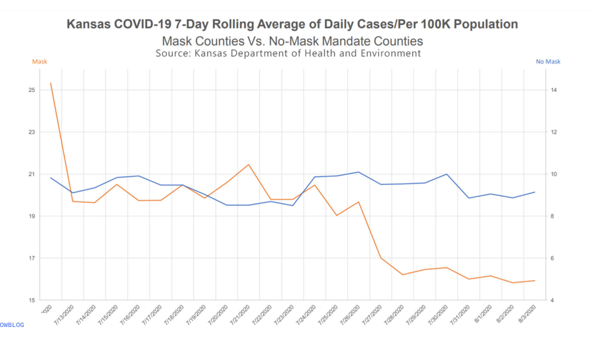

  
```{r setup, include=FALSE}
knitr::opts_chunk$set(eval = TRUE)
library(rvest)
library(tidyverse)
```


## Part 1 - Masks and COVID

The following visualization was shared [on Twitter](https://twitter.com/JonBoeckenstedt/status/1291602888376999936) as "extraordinary misleading". 

```{r fig.fullwidth=TRUE, echo=FALSE}

```

In case you don't trust Twitter (good for you!), the visualization can also be found on an official Kansas [government website](https://www.coronavirus.kdheks.gov/DocumentCenter/View/1411/Kansas-COVID-19-7-Day-Rolling-Average-of-Daily-Cases-Per-100K-Population-002).

Discuss in your group what is misleading about this visualization and how you might go about fixing it.

1. Create a data frame that can be used to re-construct the visualization. You may need to estimate some of the numbers, that's ok. You should first think about how many rows and columns you'll need and what you want to call your variables. Then, you can use the `tribble()` function for this. For example, if you wanted to construct the following data frame

```{r tribble, echo=FALSE}
df <- tribble(
  ~date, ~count,
  "1/1/2020", 15,
  "2/1/2020", 20,
  "3/1/2020", 22,
)
```

```{r}
df
```

you can write

```{r ref.label="tribble", eval = FALSE}
```

```{marginfigure}
Since the exercises for this week are short, it's possible not every team member will get to commit and push **during** the lab. However each team member should review what was created, fix typos, make edits for better presentation, etc. either during or after the lab, and before the deadline.
```

2. Make a visualization that more accurately (and honestly) tells the story. 

3. What message is more clear in your visualization than it was in the original visualization?
  
4. What, if any, useful information do these data and your visualization tell us about mask wearing and COVID? It'll be difficult to set aside what you already know about mask wearing, but you should try to focus only on what this visualization tells. Feel free to also comment on whether that lines up with what you know about mask wearing.

## Wrapping up and Submission

Make any final changes, and be sure you've followed code style guidelines. Knit, commit, and push any remaining changes to GitHub.

To submit, one team member should upload the team's PDF to Gradescope. **Be sure to select every team member's name in the Gradescope submission**. Mark where each answer is to the exercises, and associate the "Overall" question with the first page of your PDF. **If any answer spans multiple pages, then mark each of the relevant pages**. The "Overall" points will be given for things like proper GitHub usage and code style. Group members who have not participated sufficiently may receive a lower grade than the rest of the group.

There should only be **one** submission per team on Gradescope. 


## Part 2 - Work on projects

Once you're done with this week's lab, review any feedback from your project proposals, and use any remaining time to work on the projects.


