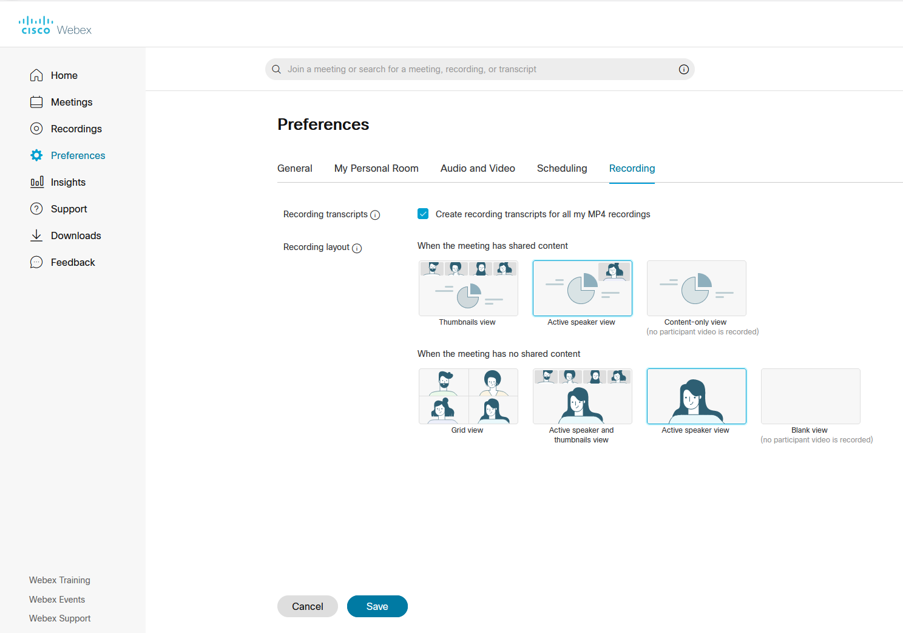

<div style= "float:right;position: relative; margin-left: 20px">
```{r setup, echo=FALSE, fig.align="right"}
knitr::include_graphics("img/laptop-3190194_1920.jpg")
```
</div>

# Timeline

Proposal due **Monday, November 2**

Draft report due **Sunday, December 6 at 11:59pm on CANVAS (not Gradescope)** 

Peer feedback due **Saturday, December 12 at 11:59pm on CANVAS**

Final report, presentation video, slides, repo due **Thursday, December 17 at 10:00am**

Presentation comments [optional extra credit] due **Sunday, December 20**

**TL;DR**: Pick a dataset and do something with it. That is your final project.

The final project for this class will consist of analysis on a dataset of your own choosing. The dataset may already exist, or you may collect your own data by scraping the web.  

Choose the data based on your group's interests or work you have done in other courses or research projects. The goal of this project is for you to demonstrate proficiency in the techniques we have covered in this class (and beyond, if you like!) and apply them to a dataset to analyze it in a meaningful way.

### Logistics

You will work on the project with your lab groups.

The five primary deliverables for the final project are

- A project proposal
- A written, reproducible report detailing your analysis
- A GitHub repository corresponding to your report
- Slides + a video presentation
- Formal peer review on another team's project

# Overall grading

The grade breakdown is as follows:

Total                                                   | 115 pts
--------------------------------------------------------|--------
**Project proposal**                                    | 10 pts
**Written report**                                      | 50 pts
**Slides**                                              | 15 pts
**Repository**                                          | 5 pts
**Video presentation**                                  | 20 pts
**Peer feedback**                                       | 15 pts

**<i>Note: No late projects are accepted.</i>**

# Data sources

In order for you to have the greatest chance of success with this project it is important that you choose a manageable dataset. This means that the data should be readily accessible and large enough that multiple relationships can be explored. Therefore, **your dataset must have at least 50 observations and at least 10 variables (exceptions can be made but you must speak with me first).**

In the dataset, there should be 

- categorical variables
- discrete numerical variables 
- continuous numerical variables 


If you are using a dataset that comes in a 
format that we haven't encountered in class (for instance, a `.DAT` file), make 
sure that you are able to load it into RStudio as this can be tricky depending 
on the source. If you are having trouble, ask for help before it is too late.

**Reusing datasets from class:** Do not reuse datasets used in examples / homework 
in the class. 

Some resources that may be helpful:

- [R Data Sources for Regression Analysis](https://rfun.library.duke.edu/blog/data-sources-for-regression-analysis/)
- [kaggle](https://www.kaggle.com/datasets)
- [FiveThirtyEight data](https://data.fivethirtyeight.com/)
- [TidyTuesday](https://github.com/rfordatascience/tidytuesday)
- [World Health Organization](https://www.who.int/gho/database/en/)
- [The National Bureau of Economic Research](https://data.nber.org/data/)
- [International Monetary Fund](https://data.imf.org/?sk=388DFA60-1D26-4ADE-B505-A05A558D9A42&sId=1479329328660)
- [General Social Survey](http://gss.norc.org/)
- [United Nations Data](http://data.un.org/)
- [United Nations Statistics Division](https://unstats.un.org/home/)
- [U.K. Data](https://data.gov.uk/)
- [U.S. Data](https://www.data.gov/)
- [U.S. Census Data](https://www.census.gov/data.html)
- [European Statistics](https://ec.europa.eu/eurostat/)
- [Statistics Canada](https://www.statcan.gc.ca/eng/start)
- [Pew Research](https://www.pewresearch.org/download-datasets/)
- [UNICEF](https://data.unicef.org/)
- [CDC](https://www.cdc.gov/datastatistics/index.html)
- [World Bank](https://datacatalog.worldbank.org/)
- [Election Studies](https://electionstudies.org//)

All analyses must be done in RStudio, and your final written report and 
analysis **must be reproducible**. This means that you must create an R Markdown
document attached to a GitHub repository that will generate your written report
exactly upon knitting.

# Project proposal 

There are two main purposes of the project proposal:

- To help you think about the project early, so you can get a head start on finding data, reading relevant literature, thinking about the questions you wish to answer, etc.
- To ensure that the data you wish to analyze, methods you plan to use, and the scope of your analysis are feasible and will help you be successful for this project.

Include the following in the proposal: 

### Section 1 - Introduction

The introduction section includes 

- an introduction to the subject matter you're investigating
- the motivation for your research question (citing any relevant literature)
- the general research question you wish to explore 
- your hypotheses regarding the research question of interest

### Section 2 - Data description 

In this section, you will describe the data set you wish to explore. This includes a description of the observations in the data set, a general description of the variables in the data set, and a description of how the data was originally collected (not how you found the data but how the original curator of the data collected it). 

### Section 3 - Glimpse of data

Use the `glimpse` function print a summary of the data at the end of your proposal.

Place your data in the `/data` folder of the repo. Later on you will include the codebook in the README of the repo. 

### Submission

Submit the PDF of your proposal in the **Project Proposal** assignment on Gradescope. Be sure to select the names of all team members in the submission. The proposal is due on **Monday, November 2.** 

### Proposal grading

Total                                                   | 10 pts
--------------------------------------------------------|--------
**Introduction**                                        | 4 pts
**Data description**                                    | 4 pts
**Glimpse of data**                                     | 2 pts

# Draft

Your team's Draft report is due **Sunday, December 6 on CANVAS (not Gradescope)**. As you work on the draft, the focus should be on the analysis and less on crafting the final report. **Your draft must include a reasonable attempt at each analysis component - exploratory data analysis, inference or modeling, and drawing initial conclusions.** It does not need to be a final report, but should be a good part of the way there.

# Peer feedback

Critically reviewing others' work is a crucial part of the scientific process, and DATA 101 is no exception. You will be assigned another team's Draft Report to review, and other students will review your draft. As part of the review process, your Draft report is due by **Sunday, December 6**. After receiving the report to be peer-reviewed, you will have until **Saturday, December 12** to provide a detailed critique about the written report and data analysis. The peer feedback will be done in Canvas. This feedback is intended to help your classmates create a high quality final project, as well as give you experience reading and constructively critiquing the work of others.

Peer feedback will be graded on the extent to which it comprehensively and constructively addresses the components of the partner team's report: the research context and motivation, exploratory data analysis, and any inference, modeling, or conclusions. **Your feedback should be specific and actionable. It should not be a proofreading (though such comments are fine too), but should focus on the content and clarity of the report, and whether it met the project's specifications and goals, as well as your suggestions for improvement.** You'll be able to make annotations at specific locations within the document, as well as write overall feedback in the sidebar. You are expected to do both. Each student will be graded (out of 15 points) on the quality of the feedback they provided.

# Written report

Your written report must be done using R Markdown. All team members must contribute to the GitHub repository, with regular meaningful commits. 

Before you finalize your write up, make sure the printing of code chunks is off with the option `echo = FALSE`. 

Your final report must match your GitHub repository *exactly*. The mandatory components of the report are below. You are free to add additional sections as necessary. The report, including visualizations, should be **no more than 10 pages long.** There is no minimum page requirement; however, you must comprehensively address all of the aspects mentioned below.

Please be judicious in what you include in your final write-up.

The written report is worth 60 points, broken down as

Total                                                   | 50 pts
--------------------------------------------------------|--------
**Introduction/data**                                   |  8 pts
**Methodology**                                         | 17 pts
**Results**                                             | 17 pts
**Discussion**                                          |  8 pts

### Introduction and data

The introduction should introduce your general research question and your data (where it came from, how it was collected, what are the observations, what are the variables, etc.). 

### Methodology 

The methodology section should include the variables used to address your research question, as well as any useful visualizations or summary statistics. Additionally, you should introduce and justify the statistical method(s) that you believe will be useful in answering your research question. 

### Results 

Showcase how you arrived at answers to your question using any techniques we have learned in this class (and some beyond, if you're feeling adventurous). Provide the main results from your analysis. The goal is not to do an exhaustive data analysis (i.e., do not calculate every statistic and procedure you have learned for every variable), but rather to show that you are proficient at asking meaningful questions and answering them with results of data analysis, that you are proficient in using R, and that you are proficient at interpreting and presenting the results. Focus on methods that help you begin to answer your research questions. 

### Discussion

This section is a conclusion and discussion. Provide a summary of what you have learned about your research question along with statistical arguments supporting your conclusions. Also, critique your own methods and provide suggestions for improving your analysis. Issues pertaining to the reliability and validity of your data and appropriateness of the statistical analysis should also be discussed here. A paragraph on what you would do differently if you were able to start over with the project, or what you would do next if you were going to continue work on the project should also be included.

# Presentation Slides

In addition to the write-up, your team must also create presentation slides that summarize and showcase your project. You may use any software for making the slides, such as Powerpoint, Keynote, Google Slides, or R Markdown (using the Xaringan package). If you are interested in using the RMarkdown Xaringan package (which was used to create all our lecture slides!), see additional information below. 

In the presentation, introduce your research question and dataset, showcase visualizations, and provide some conclusions. These slides should serve as a brief visual accompaniment to your write-up and will be graded for content and quality. For submission, convert these slides to a .pdf document to be submitted in Canvas. The slides are due on **Thursday, December 17 at 10:00am**.

The slide deck should have no more than **6 content slides + 1 title slide**. Here is a *suggested* outline as you think through the slides; you do *not* have to use this exact format for the slide deck.

- Title Slide
- Slide 1: Introduce the topic and motivation
- Slide 2: Introduce the data
- Slide 3 - 4: Highlights from EDA
- Slide 4 - 5: Modeling/Inference
- Slide 6: Conclusions + future work

If you're interested in generating your slides in R using the Xaringan package, see installation instructions [here](https://slides.yihui.org/xaringan/#8). You can find a sample folder structure [here](https://github.com/ids-s1-20/PROJECT-TEMPLATE/tree/main/presentation). The file `presentation.Rmd` (contained in the linked repo) will generate [this presentation](https://ids-s1-20.github.io/PROJECT-TEMPLATE/presentation/presentation.html) when knit. If you need help with this, just ask me!

# Video presentation

Sometime before **Thursday, December 17 at 10:00am**, you/your group will upload a video presentation of your project. Note that all members must present, and that there is a strict **10-minute time limit**. Your submission for the video will be a **link** to the video, stored in the cloud (could be stored in your Ramapo accounts for Webex, Techsmith Knowmia, or Google Drive, for example). Your video does not need to be publicly accessible! It can be "unlisted" and available only to those with the link, or you may password protect it - be sure to submit the password so I have it.

For the presentation, you can speak over your slide deck, similar to the course lesson videos. It's nice if you include thumbnail videos of your faces in the corner, but it's not required. Your presentation should be a self-contained overview of your project, taking viewers through the background, questions you set out to answer, how you approached the questions, results, and a conclusion/future work.
<!-- not just be an account of everything you  -->
<!-- tried ("then we did this, then we did this, etc."), instead it should convey what  -->
<!-- choices you made, and why, and what you found. -->

You can record the video however you like. One suggestion would be to use **Webex**. You can schedule a Webex meeting for your group and record the meeting. Have one person share the slides, and then give your presentation in this meeting. The recording will be stored in the meeting host's Webex account, accessible at [http://ramapo.webex.com](http://ramapo.webex.com). You'll be able to trim the beginning and end of the video through the Webex site - here are [instructions](https://help.webex.com/en-us/0zbv00/Trim-the-Beginning-and-End-of-Your-Webex-Meetings-or-Events-Recording). Before the meeting, I recommend that the host go to the [Webex site](http://ramapo.webex.com) and configure the following settings for recordings - **be sure to Save the settings after you configure them!**

```{r echo = FALSE, fig.cap = "Recommended settings for Webex recording"}

```

# Project repository

In addition to your Canvas submissions, I will be checking your GitHub repository. This repository should be contributed to equally by all team members and should include

- RMarkdown files (formatted to clearly present all of your code and results): one for the proposal and one for the final report (feel free to copy/paste between these)
- Meaningful README file on the GitHub repository that contains a *codebook*
for relevant variables
- Dataset(s) (in csv or RData format, in a `/data` folder)

Style and format does count for this assignment, so please take the time to make sure everything looks good and your data and code are properly formatted.

The repository must be finalized by **Thursday, December 17 at 10:00am**.

# Peer teamwork evaluation

You will be asked to fill out a survey where you rate the contribution and teamwork of each team member by assigning a contribution percentage for each team member. Filling out the survey is a prerequisite for getting credit on the team member evaluation. If you are suggesting that an individual did less than half the expected contribution given your team size (e.g., for a team of four students, if a student contributed less than 12.5% of the total effort), please
provide some explanation. If any individual gets an average peer score 
indicating that this was the case, their grade will be assessed accordingly.


# Additional notes and tips

The project is very open ended. For instance, in creating a compelling 
visualization(s) of your data in R, there is no limit on what tools or 
packages you may use. You do not need to visualize all of the data at once. A single high quality visualization will receive a much higher grade than a large number of poor quality visualizations.

Pay attention to details in your write-up and presentation. Neatness, coherency, and clarity will count, as will spelling and grammar.


### Tips

- Ask questions if any of the expectations are 
unclear.

- *Code*: In your write up your code should be hidden (`echo = FALSE`) so that your document is neat and easy to read. However your document should include all your code such that if I re-knit your Rmd file I should be able to obtain the results you presented. 
  - **Exception:** If you want to highlight something 
specific about a piece of code, you're welcome to show that portion. 
- Merge conflicts will 
happen, issues will arise, and that’s fine! Commit and push often, and ask questions when stuck.
- Make sure each team member is contributing, both in terms of quality and quantity of contribution (we will be reviewing commits from different team  members).
- All team members are expected to contribute equally to the completion of this assignment and group assessments will be given at its completion - anyone judged to not have sufficient contributed to the final product will have their grade penalized. While different teams members may have different backgrounds and abilities, it is the responsibility of every team member to understand how and why all the code and techniques work.

### Installing packages

While you are used to *loading* packages using the `library()` function, that will only work for packages that are installed. You may wish to install additional packages for your project. **Notably, the tidymodels packages have not been installed by default and you will need to install them yourself.** To do this, go to the **Console** pane in RStudio and run the following command (substituting the desired package name for `tidymodels` if applicable). This only needs to be done once. After that, you'll be able to load the package through a `library` command in your RMarkdown document.

```{r echo = T, eval = F}
install.packages("tidymodels")
```

### Suppress Code, Warnings, & Messages

```{r echo = F, warning = F, message = F}
library(tidyverse)
library(knitr)
library(broom)
```

- Include the following code in a code chunk at the top of your .Rmd file to suppress all code, warnings, and other messages. Use the code chunk header `{r setup, include = FALSE}` to suppress this setup code. 

```{r echo = T, eval = F}
knitr::opts_chunk$set(echo = FALSE,
                      warning = FALSE, 
                      message = FALSE)
```

### Headers

- Use Markdown headers to clearly label each section. Make sure there is a space between the last `#` and the title, so the header renders correctly. For example, `###Section Title` will not render as header, but `### Section Title` will. The number of hashtags corresponds to the header level - fewer hashtags are for more-major headings.

### References 

- Include all references in a section called "References" at the end of the report. 
- See [this page](http://libraryguides.vu.edu.au/c.php?g=386501&p=4347840) for guidance on proper citation for datasets. If you got your data off the web, make sure to note the retrieval date.
- Optional: If you'd like to learn about BibTeX, a common citation management format, and how it is used in R Markdown, see [Section 4.5](https://bookdown.org/yihui/rmarkdown-cookbook/bibliography.html) of the R Markdown Cookbook. This advanced method for citing references is not required, but might interest some of you.

### Resize figures

- You can resize plots and figures, so you have more space for the narrative. 
    - **To resize individual figures**: Use the code chunk header `{r plot1, fig.height = 3, fig.width = 5}`, replacing `plot1` with a meaningful label and the height and width with values appropriate for your write up.
    - **To resize all figures**: Include the `fig_width` and `fig_height` options in your YAML header as shown below:

```
---
title: "Your Title"
author: "Team Name + Group Members"
output: 
  pdf_document:
    fig_width: 5
    fig_height: 3
---
```
 
Replace the height and width values with values appropriate for your write up.

### Arranging plots

You can arrange plots in a grid, instead of one after the other. This is especially useful when displaying plots for exploratory data analysis and to check assumptions. The `patchwork` package makes this easy to do. See the documentation and examples [here](https://patchwork.data-imaginist.com/).

### Plot titles and axis labels

Be sure all plot titles and axis labels are visible and easy to read. 

- Use informative titles, *not* variable names, for titles and axis labels.
- You can use `coord_flip()` to flip the $x$ and $y$ axes on the plot. This is useful if you have a bar plot with an $x$-axis that is difficult to read due to overlapping text. 

`r emo::ji("x")` **NO! The x-axis is hard to read because the names overlap.**

```{r}
ggplot(data = mpg, aes(x = manufacturer)) +
  geom_bar()
```

`r emo::ji("white_check_mark")` **YES! Names are readable**

```{r}
ggplot(data = mpg, aes(x = manufacturer)) +
  geom_bar() +
  coord_flip()
```

### Make your plots look professional!

Below is an improved version of the above plot:

- Informative title and axis labels
- Flipped coordinates to make names readable
- Arranged bars based on count
- Capitalized manufacturer names
- (Optional:) Added color - Use a coordinated color scheme throughout paper/presentation
- (Optional:) Applied a theme - Use same theme throughout paper/presentation

```{r}
mpg %>%
  count(manufacturer) %>%
  mutate(manufacturer = str_to_title(manufacturer)) %>%
  ggplot(aes(x = fct_reorder(manufacturer,n), y = n)) +
  geom_bar(stat = "identity", fill = "steelblue") +
  coord_flip() +
  labs(x = "Manufacturer", 
       y = "Count", 
       title = "The most common manufacturer is Dodge") +
  theme_bw() 
```


### Tables and model output

- Use the `kable` function from the knitr package to neatly output all tables and model output. This will also ensure all model coefficients are displayed. 
  - Use the `digits` argument to display only 3 or 4 significant digits. 
  - Use the `caption` argument to add captions to your table. 


```{r model-ex}
model <- lm(mpg ~ hp, data = mtcars)
tidy(model) %>%
  kable(digits = 3)
```


### Guidelines for communicating results 

- **Don't use variable names in your narrative!** Use descriptive terms, so the reader understands your narrative without relying on the codebook.
  - `r emo::ji("x")` There is a negative linear relationship between mpg and hp.
  - `r emo::ji("white_check_mark")` There is a negative linear relationship between a car's fuel economy (in miles per gallon) and its horsepower.
- **Know your audience:** Your report should be written for a general audience who has an understanding of Data Science at the level of DATA 101.
- **Avoid subject matter jargon:** Don't assume the audience knows all of the specific terminology related to your subject area. If you must use jargon, include a brief definition the first time you introduce a term. 
- **Tell the "so what":** Your report and presentation should be more than a list of interpretations and technical definitions. Focus on what the results mean, i.e. what you want the audience to know about your topic after reading your report or viewing your presentation. 
- **Tell a story:** All visualizations, tables, model output, and narrative should be part of a cohesive story.
- **Use one voice:** Though multiple people are writing the report, it should read as if it's from a single author. At least one team member should read through the entire report before submission to ensure it reads like a cohesive document.

# Grading summary

Grading of the project will take into account the following:

- Content: Is the research question well designed and is the data being used relevant to the research question?
- Content: Did the team use appropriate statistical procedures and interpretations of results accurately?
- Creativity and Critical Thought: Is the project carefully thought out? Are the limitations carefully considered?
- Does it appear that time and effort went into the planning and implementation of the project?
- Slides: Are the slides well organized, readable, not full of text, featuring figures with legible labels, legends, etc.?
- Professionalism: How well did the team present? Does the presentation appear to be well practiced? Did everyone get a chance to say something meaningful about the project?
- Teamwork: Did the team present a unified story, or did it seem like independent pieces of work patched together?

A general breakdown of scoring is as follows:

- *90%-100%*: Outstanding effort. Student understands how to apply all statistical 
concepts, can put the results into a cogent argument, can identify weaknesses in 
the argument, and can clearly communicate the results to others.
- *80%-89%*: Good effort. Student understands most of the concepts, puts together 
an adequate argument, identifies some weaknesses of their argument, and communicates 
most results clearly to others.
- *70%-79%*: Passing effort. Student has misunderstanding of concepts in several 
areas, has some trouble putting results together in a cogent argument, and communication 
of results is sometimes unclear.
- *60%-69%*: Struggling effort. Student is making some effort, but has misunderstanding 
of many concepts and is unable to put together a cogent argument. Communication 
of results is unclear.
- *Below 60%*: Student is not making a sufficient effort.

## Late work policy

**There is no late work accepted on this project.** Be sure to turn in your work early to avoid any technological mishaps.

*Acknowledgement: Project guidelines modified from datasciencebox.org and Duke's STA 199.*
